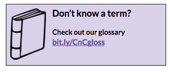

#Coding & Cocktails Session 6:
## Programming Concepts 101: Intro to jQuery & JavaScript {#intro-to-javascript-using-jquery}

###Overview
Practice using JavaScript and jQuery to make our web applications respond to user interaction.  

###Project
Part 1 will introduce some common concepts.
#TODO: Describe these better.

Part 2 will include changing colors, hiding & showing elements and more.

Part 3 will add in a content slider.  This is very useful to scroll through pictures, text, videos or any other html items on a website.  Part 3 uses a library called bxSlider.

### Helpful Keyboard Shortcuts
|Command|Mac Key Combination|Windows Key Combination|
|--|--|--|
|Cut|`cmd` + `x`|`ctrl` + `x`|
|Copy|`cmd` + `c`|`ctrl` + `c`|
|Paste|`cmd` + `v`|`ctrl` + `v`|
|Undo|`cmd` + `z`|`ctrl` + `z`|
|Redo|`cmd` + `y`|`ctrl` + `y`|
|Save|`cmd` + `s`|`ctrl` + `s`|
|Select all|`cmd` + `a`|`ctrl` + `a`|
|Find|`cmd` + `f`|`ctrl` + `f`|
|Switch between open apps/programs |`cmd` + `tab`|`alt` + `tab`|
|Switch between programs on the taskbar| N/A | `windows key` + `tab`|
|Switch between Chrome windows. |`shift` + `cmd` + `~`| N/A |


While following along with the worksheet, type out the commands instead of doing a copy & paste (_unless instructed to copy & paste_) to avoid inadvertently using any incorrect characters.


