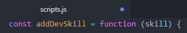

1. In your Atom, open _scripts.js_. You'll see MadLibs items like we had in the first section of the worksheet. 

1. Search for **&lt;noun>** and **&lt;verb>** and replace the variables. Save the file and look at the web page in Chrome. The lavender button now has the text "I'd like a cocktail please!", but we want it do something when we click on it.
   
**Every time you make a change, save the file.** 

The atom-live-server package will automatically refresh the Chrome tab to keep the app up to date with your **saved** work. Atom alerts you to unsaved work by displaying a blue circle in the tab:



Save the file by navigating to **File** <i class="fa fa-long-arrow-right"></i> **Save** or by using the keyboard shortcut `cmd` + `s` for Macs and `ctrl` + `s` for Windows. Refer to [Helpful Keyboard Shortcuts](/references).
   

   
View the worksheet and the IDE in split screen mode to make it easier to work through tonight's session. Check out the [helpful tips in the Setup guide](/setup#tips). 
   

1. Let's display an alert message by adding `alert('click');` inside the `clickHandler` function in Atom. The `clickHandler` function should look like this:

   ```javascript
const clickHandler = function(text) {
      alert('click');
}
   ```

1. Now try clicking the button in Chrome. An alert message appears! Close the alert message by clicking "Ok".

1. In Atom, define a new variable called `numberOfClicks` above the line with the code `const clickHandler = function(text)` so we can keep track of the number of button clicks and set the value to 0. Your variable should look like this:

   ```javascript
var numberOfClicks = 0;
   ```

   
You declared `numberOfClicks` variable outside of the function so that it's accessible by more than `clickHandler` function. The **scope** of the variable and function determines accessibility of that variable or function in the application. We will learn more about scope next session.
   

1. Track the clicks by incrementing `numberOfClicks` by 1 for each button click. We can do this inside the `clickHandler` function. Place your cursor after the opening curly brace and press `Enter` to create a new line above `alert('click');`. Type the following statement:

   ```javascript
numberOfClicks = numberOfClicks + 1;
   ```
   
We are adding 1 to `numberOfClicks` variables and setting the result back to `numberOfClicks`. 

There are other ways to assign an increment to the `numberOfClicks` variable. You could have also written:
```javascript
numberOfClicks += 1;
numberOfClicks++;
```
     

1. Update the alert message to show the number of clicks by adding `numberOfClicks` to the display text using string concatenation.
   ```javascript
alert('click ' + numberOfClicks);
   ```

1. In Chrome, click the button a few times to see your click counter in action. Don't forget to close the alert message between each click.


