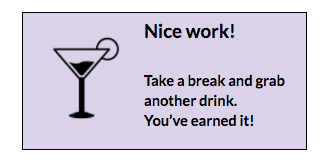

### Part 2: Common Interactions with jQuery

#### Setup

1.  In Git Bash or iTerm2, type `cd ~/CodingAndCocktails` to make sure you're in your CodingAndCocktails directory that was created during the setup of The Tools.

2. In Google Chrome, navigate to https://github.com/KansasCityWomeninTechnology/DrinkOrderApp/archive/jquery-master.zip to download the project starting point.

3. Unzip it. 

# TODO - Unzip Directions

3. In Atom, open the DrinkOrderApp folder by going to the File menu and choosing **Add Project Folder**. Navigate to the unzipped DrinkOrderApp folder that you created and click OK.

4.  In Google Chrome, open the _index.html_ file and try clicking the buttons.  Not very exciting yet, is it?
 
#### Connecting HTML & JavaScript

1. Connect the HTML & the JavaScript files.

    
If you missed the HTML session and aren't sure what an HTML tag is, grab a mentor to give you a quick overview and help catch you up!
    

  1.  In Atom, open the _index.html_ file.  
  
  2. Just above the `</head>` tag in the _index.html_ file, add a ``

   3. On a separate line just below the jQuery script tag you just created and just above the `</head>` tag, add a `<script>` tag with a `src` attribute for the JavaScript file that you'll be changing (located at assets/scripts/my-scripts.js). 

   
Order of the script tags you add matters! Script tags are executed in the order that they appear in your HTML code so because our _my_scripts.js_ file will depend on jQuery, make sure the `<script>` tag for _my_scripts.js_ comes after the `<script>` tag for the jQuery library.

For a refresher on Script tags check out bit.ly/scriptElement

For further reading on using jQuery in a project navigate to bit.ly/StartjQuery
    

#### Adding Interaction
1.  Open the _my-scripts.js_ file in Atom from the assets/scripts folder. This is where jQuery code goes.

1.  First make sure the HTML document is ready before it tries to run anything.  

Remember we do this using `$(document).ready();`  Hint: [bit.ly/docReady](https://www.google.com/url?q=http://bit.ly/docReady&sa=D&ust=1478465001110000&usg=AFQjCNFPlR8KVar8yLLamN-w76KLh-3Fxw) Don’t forget that we need a function in there so we can actually run our code!

1.  We’ll want to be able to see our menu so we need to make the “Show Menu” button function properly.  When we click the button we want to display the `#menu` div.

  1.  First we have to capture the event inside your `$(document).ready(function () { ... });` code in **my-scripts.js**

      1.  Select your button (check out index.html to find the button’s id to select)
      2.  Add the click event handler to the button.
   Hint: `$(“#my-id”).click();`

  1.  Next we have to add our action:

      1.  Inside of the click event handler we need to add the function to run the action we’re going to do.  This is similar to how we created the function to run when the document is ready. Hint: `$(“#my-id”).click(function () { … });`

      1.  Inside of that function, select the element you want to act on, in this case the #menu div.
      2.  Add a jQuery action to show that HTML div. **Hint:** `$("#my-id").show();`

1.  Refresh the open index.html in Google Chrome and try clicking the Show button.  It should display a menu when you click on it.

1.  Now that we’ve displayed the menu we want to be able to hide it when we don’t want to see it. Hide the `#menu` div element when the hide menu button is clicked in **my-scripts.js**.  This will be very similar to what we just did with the show menu button but a different action on the div.

  1.  First we have to capture the event:

      1.  Select your button (check out index.html to find the button’s id to select)
      2.  Add the click event handler to the button. Hint: [bit.ly/CnCClick](https://www.google.com/url?q=http://bit.ly/CnCClick&sa=D&ust=1478465001119000&usg=AFQjCNGFLGYK72Z48aU6ZdHoxPLn8iGxog)

  1.  Next we have to add our action:

      1.  Inside of the click event handler we need to add the function to run the action we’re going to do.  This is similar to how we created the function to run when the document is ready.
      2.  Inside of that function, select the element you want to act on, in this case the `#menu` div. **Hint:** [bit.ly/CnCSelect](https://www.google.com/url?q=http://bit.ly/CnCSelect&sa=D&ust=1478465001120000&usg=AFQjCNGaRchbzwN8596cSVEIHMgC15TjMw)
      3.  Add a jQuery action to show that HTML div.** Hint:** [bit.ly/CnCHide](https://www.google.com/url?q=http://bit.ly/CnCHide&sa=D&ust=1478465001121000&usg=AFQjCNF9S4iE-RvWIXx6KJXlfMajErm5JA)

      **You’ve added your first interactivity to your website! Celebrate with a toast with your neighbor!**

1.  Next we’re going to practice another common interaction on web pages: changing element styling triggered by an event.  When the checkbox next to a drink is selected, make the background of the drink label change colors.

  1.  First we have to capture the event:

      1.  Select your check box.  Look at the HTML to see what this structure like.  We’ll need to utilize CSS attribute selectors this time.  These look like `cssElement[“attribute=value”]`  **Hint:** [bit.ly/AttrSel](http://bit.ly/AttrSel)  Don’t know what an attribute is?  Check this out: [http://bit.ly/Attribs](http://bit.ly/Attribs)
      2.  Add the click event handler like we did in step 8.a.ii. Hint: [bit.ly/CnCClick](http://bit.ly/CnCClick)

   1.  Next we have to add our action:

      1.  Inside of the click event handler we need to add the function to run the action we’re going to do.  This is similar to how we created the function to run when the document is ready.
      2.  Inside of that function, this time we’re going to need the input’s parent element: the label.  **Hint:** [bit.ly/CnCparent](https://www.google.com/url?q=http://bit.ly/CnCparent&sa=D&ust=1478465001125000&usg=AFQjCNE4INDAs5xRmmQl2TP1uUcO0N0qNg)
      3.  We only want the color to show when the box is checked. There are a few ways to do this and often changing styling you’d use the `.css()` method: [bit.ly/CnCCSS](https://www.google.com/url?q=http://bit.ly/CnCCSS&sa=D&ust=1478465001126000&usg=AFQjCNGX4XkLprOujxC6Yb72j_nna1rLVw).  This time since we want to add and remove it we’re just going to toggle the CSS styling class using the jQuery method `toggleClass()` Hint: [bit.ly/ToggleC](https://www.google.com/url?q=http://bit.ly/ToggleC&sa=D&ust=1478465001127000&usg=AFQjCNE_zKIpUHHNGJONJhbO2zFA_W4qng)  We’ve already set up the highlight class for you in the **assets/styles/main.css** file.

1.  **EXTRA CREDIT:** Make clicking the &quot;Order&quot; button get the value from the name radio button input and display it in an h1 tag inside the light purple div as &quot;{{name}}&#039;s order is ready!&quot;

    1.  First capture the event on the Order button:

      1.  Select the Order button like we’ve selected the show and hide buttons above. (check out index.html to find the button’s id to select)
      2.  Add the click event handler to the button Hint: [bit.ly/CnCClick](https://www.google.com/url?q=http://bit.ly/CnCClick&sa=D&ust=1478465001130000&usg=AFQjCNE9sKnrtJJdiDZGcwrRkpyOAwaCvg)

  1.  Next we have to add our action but this time we’re going to have to save the name value so we can use it again later.

      1.  Create your **orderName** variable.  Remember when you declare a variable you must start with the `var` keyword!
      2.  We need to capture the radio button input’s value in this variable  so let’s get it selected!  Note: we only need to store the value for the input element that is “checked.” **Hint 1:** [bit.ly/CnCRadio](https://www.google.com/url?q=http://bit.ly/CnCRadio&sa=D&ust=1478465001132000&usg=AFQjCNFkmjVHQ0WwM9G63fZV5-bX8fqeJw) **Hint 2:** [bit.ly/CnCChecked](http://bit.ly/CnCChecked) **Hint 3:** [bit.ly/CnCVal](https://www.google.com/url?q=http://bit.ly/CnCVal&sa=D&ust=1478465001133000&usg=AFQjCNEOLMx1XT212cHayeyAbhTunDflNg) **Hint 4:** `var myVar = $("input:input-type:checked").method();`
      3.  Once you’ve stored the value in your variable you can check the value in Chrome’s Developer Tools Console tab using `console.log(orderName);` in your script file.  When you trigger that event the variable’s value will then be displayed to the console. **Hint:** [bit.ly/CnCOutput](http://bit.ly/CnCOutput)
      4.  Now that we have captured the value, we need to display that in our div section.  There are again multiple ways to do this: the `append()` method: [bit.ly/CnCAppend](http://bit.ly/CnCAppend)  and the `html()` method: [bit.ly/CnCHTML](http://bit.ly/CnCHTML), though one of these is a better choice than the other. Can you figure out why one of these is a better option?  Talk it over with a mentor if you aren’t sure! **Hint:** Try both options and push the order button multiple times for each to see what happens!

          1.  First select the **div** section you want to act on.  (find the id of the element in the **index.html** file and select it)
          2.  Next we’ll use append or html to add the **h1** tag and content inside the div.  See the “JavaScript String Operators” section of the JavaScript Operators page: [bit.ly/CnCOps](http://bit.ly/CnCOps) for a reminder on how to use your variable with other static text.

1.  When you’ve worked through each piece of interaction, compare your code to our answer key here: [bit.ly/CnCJQKey](http://bit.ly/CnCJQKey)

